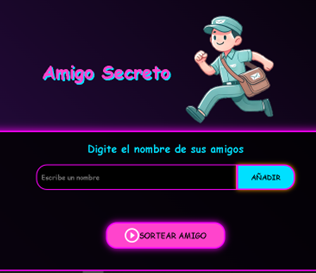
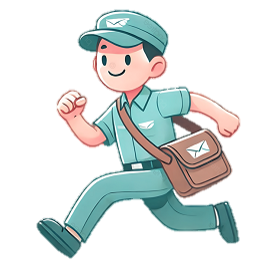

# Amigo Secreto 80s

Este es un proyecto web para realizar sorteos de Amigo Secreto con un estilo retro inspirado en los años 80. Permite ingresar una cantidad ilimitada de nombres, visualizar la lista en la página y sortear el Amigo Secreto manualmente con un botón de sorteo.

## Características

- **Interfaz Retro**: Diseño inspirado en los colores y estética de los años 80.
- **Lista Dinámica**: Se pueden agregar nombres sin límites.
- **Sorteo Manual**: Un botón permite realizar el sorteo de forma manual.
- **Fácil de Usar**: Interfaz sencilla y funcional para todos los usuarios.




## Tecnologías Utilizadas

- **HTML, CSS y JavaScript**
- **Estilos retro con fuentes y colores ochenteros**


## Instalación y Uso

1. Clonar el repositorio:
   ```https://github.com/santander73/challenge-amigo-secreto-esp-main.git
   ```
2. Abrir el archivo `index.html` en un navegador web.
3. Agregar los nombres deseados en la lista.
4. Presionar el botón para realizar el sorteo del Amigo Secreto.


## Licencia

Este proyecto está bajo la licencia MIT. Puedes usarlo y modificarlo libremente.

---


🎨 **Desarrollado por José Luis** 🎨

